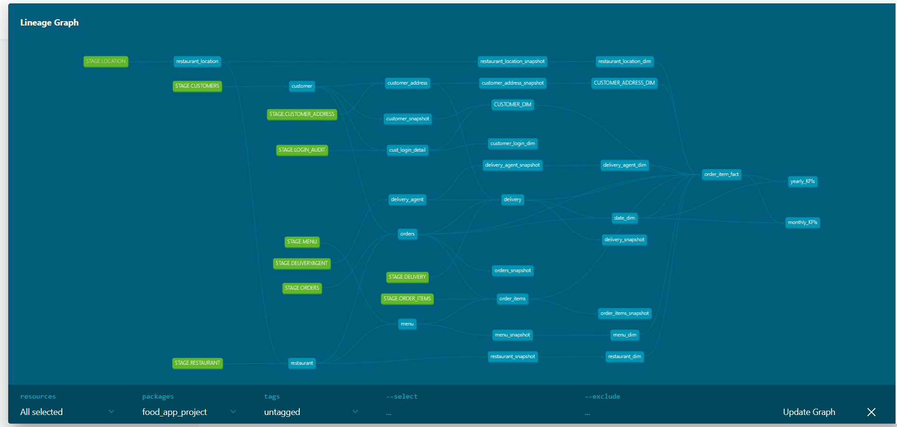

# 🍴 Food Delivery Analytics Pipeline  

## 📌 Project Overview  
This project demonstrates an **end-to-end Data Engineering pipeline** built with **Snowflake** and **dbt**.  
It ingests raw CSVs, stages them in Snowflake, applies transformations with **dbt**, implements **SCD Type 2** with dbt snapshots, and builds a **Reporting Layer with Star Schema + KPI Views** for analytics dashboards.  

---

## 🏗️ High-Level Architecture  

![High Level Architecture] (Project Docs\high level architecture.png)

**Flow:**  
1. **Data Ingestion** → Raw CSV files → Snowflake Stage  
2. **Stage Layer** → Data staged with **Streams** for CDC in Staging layer tables
3. **Transform Layer** → dbt models clean, enrich & standardize with help of macros 
4. **Snapshot Layer** → dbt **SCD2 Snapshots** for history tracking  
5. **Reporting Layer** → Star Schema (Facts & Dimensions) + KPI Views  
6. **Dashboards** → Snowflake Snowsight  

---

## 📂 Data Sources  

Raw data is provided as CSV files:  

```
initial_stage/customer_address/customer_address_book_initial.csv
initial_stage/customers/customers-initial.csv
initial_stage/delivery/delivery-initial-load.csv
initial_stage/delivery_agent/delivery-agent-initial.csv
initial_stage/location/location-5rows.csv
initial_stage/login/login-audit-initial.csv
initial_stage/menu/menu-initial-load.csv
initial_stage/order/orders-initial.csv
initial_stage/order_items/order-Item-initial.csv
initial_stage/order_items/order-item-initial-v2.csv
initial_stage/restaurants/restaurant-delhi+NCR.csv
```

---

## 🗄️ Data Pipeline Layers  

### 1️⃣ Stage Layer (Raw + Streams)  
**Schema:** `STAGE_LAYER`  
- Tables: `CUSTOMERS`, `CUSTOMER_ADDRESS`, `DELIVERY`, `DELIVERYAGENT`, `LOCATION`, `LOGIN_AUDIT`, `MENU`, `ORDERS`, `ORDER_ITEMS`, `RESTAURANT`  
- Streams: `CUSTOMER_STREAM`, `CUSTOMER_ADDRESS_STREAM`, `DELIVERY_STRM`, `DELIVERY_AGENT_STREAM`, `LOCATION_STREAM`, `LOGIN_STREAM`, `MENU_STRM`, `ORDER_STREAM`, `ORDER_ITEM_STREAM`, `RESTAURANT_STRM`  

---

### 2️⃣ Transform Layer  
**Schema:** `TRANSFORM_LAYER`  
- Models: `CUSTOMER`, `CUSTOMER_ADDRESS`, `CUST_LOGIN_DETAIL`, `DELIVERY`, `DELIVERY_AGENT`, `MENU`, `ORDERS`, `ORDER_ITEMS`, `RESTAURANT`, `RESTAURANT_LOCATION`  
- Applied **dbt macros, null handling, enrichment, validations**  

---

### 3️⃣ Snapshot Layer (SCD Type 2)  
**Schema:** `SNAPSHOT_LAYER`  
- Snapshots:  
  - `CUSTOMER_SNAPSHOT`  
  - `CUSTOMER_ADDRESS_SNAPSHOT`  
  - `DELIVERY_AGENT_SNAPSHOT`  
  - `MENU_SNAPSHOT`  
  - `RESTAURANT_LOCATION_SNAPSHOT`  
  - `RESTAURANT_SNAPSHOT`  

---

### 4️⃣ Reporting Layer (Star Schema + Views)  
**Schema:** `REPORTING_LAYER`  

#### Dimensions  
- `CUSTOMER_DIM`  
- `CUSTOMER_ADDRESS_DIM`  
- `DELIVERY_AGENT_DIM`  
- `MENU_DIM`  
- `RESTAURANT_DIM`  
- `RESTAURANT_LOCATION_DIM`  
- `DATE_DIM`  

#### Fact  
- `ORDER_ITEM_FACT`  

#### KPI Views  
- `MONTHLY_KPIS`  
- `YEARLY_KPIS`  

---

## 📊 Data Model  

### Entity-Relationship (Star Schema)  
  

### dbt Lineage Graph  
  

---

## 📈 Dashboard  

### KPI Dashboards in Snowsight  
- **Monthly Revenue**  
- **Monthly Order KPIs (Revenue per Restaurant, Avg Order Value)**  
- **Yearly KPIs (Revenue, Revenue per Customer, Revenue per Restaurant)**  

  

---

## 🚀 Tech Stack  
- **Snowflake** – Data warehouse & staging  
- **dbt** – Transformations, macros, snapshots  
- **Snowflake Streams** – CDC handling  
- **Snowsight** – Dashboards & reporting  

---

## 🔑 Key Features  
- End-to-end ELT flow from raw → reporting  
- **CDC with Streams**  
- **SCD Type 2** with dbt snapshots  
- Cleaned, enriched, and standardized data  
- **Star Schema for BI**  
- KPI-based dashboards  

---
## 👨‍💻 Author  
**Sumeet Karmankar**  
📌 Data Engineering & Analytics Enthusiast  
